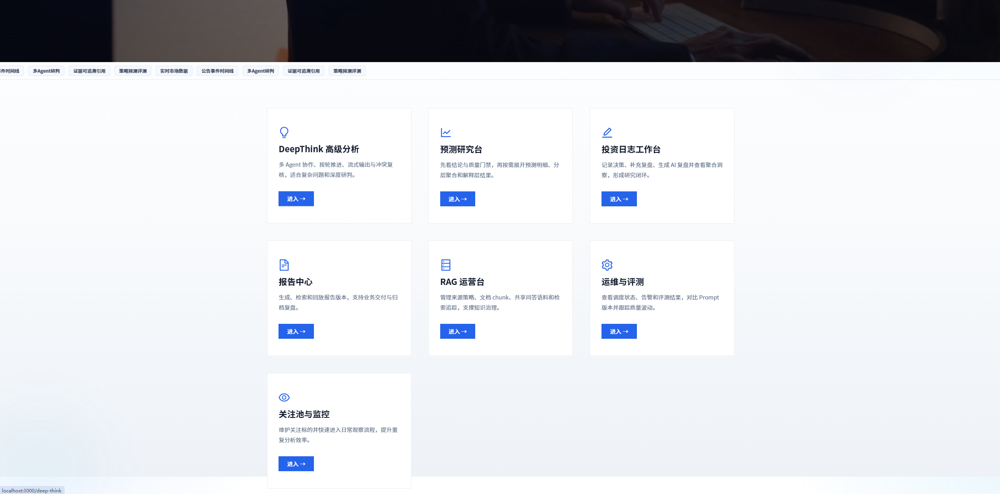
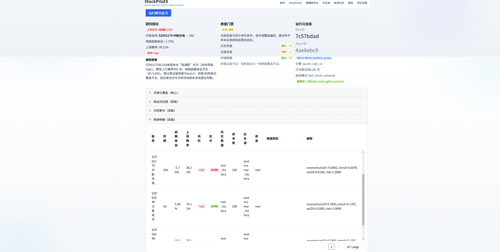
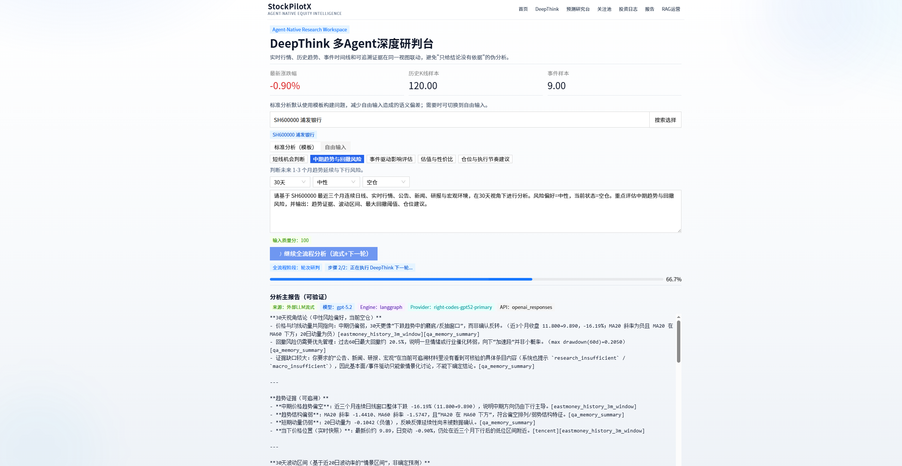
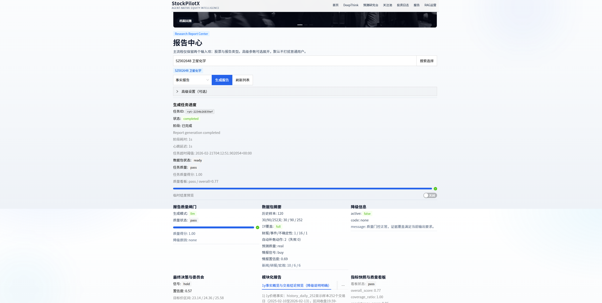
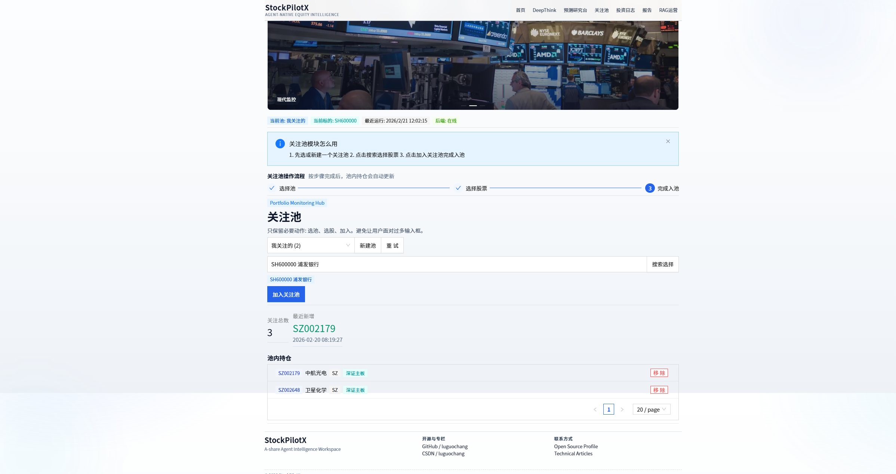

# StockPilotX

<div align="center">

**🚀 基于多Agent协作的智能股票分析系统**

[](LICENSE)
[](https://www.python.org/downloads/)
[](https://github.com/langchain-ai/langchain)

[技术博客](https://blog.csdn.net/luguochang/category_13131308.html) | [问题反馈](https://github.com/luguochang/StockPilotX/issues)

</div>

---

## 📖 项目简介

**StockPilotX** 是一个生产级的AI驱动股票分析系统，通过8个专业Agent协作，结合RAG检索增强技术，为投资者提供多维度的股票分析和投资建议。

### 为什么需要这个系统？

传统的股票分析工具存在以下问题：
- **单一维度分析**：只看技术面或基本面，缺乏全局视角
- **信息过载**：海量研报、新闻、公告，人工难以处理
- **主观偏见**：个人情绪影响决策，缺乏理性分析
- **时效性差**：人工分析耗时长，错过最佳时机

StockPilotX通过AI技术解决这些痛点：
- **8维度分析**：技术面、基本面、资金面、情绪面、估值、行业、政策、风险
- **自动化处理**：自动抓取、解析、分析海量数据
- **多Agent辩论**：8个专业Agent从不同角度分析，避免单一视角偏见
- **实时响应**：流式输出，3秒内给出初步分析结果

### 核心价值

✅ **全面性**：8个维度覆盖股票分析的所有关键要素
✅ **客观性**：多Agent辩论机制，避免单一视角偏见
✅ **时效性**：自动化数据采集和分析，实时更新
✅ **可解释性**：每个结论都有详细的推理过程和数据支撑
✅ **生产级**：99.55%可用性，支持高并发，成本可控

---

## 📸 功能展示

<table>
  <tr>
    <td width="50%">
      
      <p align="center"><b>首页 - 股票搜索</b></p>
    </td>
    <td width="50%">
      
      <p align="center"><b>预测研究台 - 多Agent协作</b></p>
    </td>
  </tr>
  <tr>
    <td width="50%">
      
      <p align="center"><b>Deep Think - 深度推理</b></p>
    </td>
    <td width="50%">
      
      <p align="center"><b>报告中心 - 历史报告管理</b></p>
    </td>
  </tr>
  <tr>
    <td width="50%">
      
      <p align="center"><b>关注池 - 自选股管理</b></p>
    </td>
    <td width="50%">
      
      <p align="center"><b>Deep Think - 推理详情</b></p>
    </td>
  </tr>
</table>

---

## 🎯 核心业务场景

### 场景1：股票投资决策

**用户需求**：我想买茅台（600519），现在是不是好时机？

**系统分析流程**：

```
用户输入：600519
    ↓
【数据采集层】自动抓取多源数据
    ├─ 实时行情：当前价格、涨跌幅、成交量（新浪财经API）
    ├─ 财务数据：ROE、净利润、负债率（同花顺API）
    ├─ 研报文档：券商研报、行业报告（东方财富）
    └─ 新闻舆情：财经新闻、社交媒体（财联社、雪球）
    ↓
【RAG检索层】从知识库检索相关信息
    ├─ 向量检索：语义相似的历史分析、研报片段
    ├─ BM25检索：关键词匹配的财务指标、行业数据
    └─ 可靠度加权：高质量来源（券商研报）权重更高
    ↓
【多Agent分析层】8个专业Agent并行分析
    ├─ Quant Agent：PE=35（行业均值30），PB=8.5，估值偏高
    ├─ Risk Agent：近3月最大回撤15%，波动率偏高，风险中等
    ├─ PM Agent：白酒行业复苏，消费升级趋势明确
    ├─ Macro Agent：政策支持消费，宏观环境利好
    ├─ Execution Agent：建议分批建仓，单次不超过30%
    ├─ Compliance Agent：无违规风险，信息披露完整
    └─ Critic Agent：数据完整，逻辑一致，结论可信
    ↓
【两层仲裁层】Supervisor Agent综合判断
    ├─ 第一层：7个Agent投票，4票看多，2票中性，1票看空
    ├─ 冲突检测：Quant认为估值高 vs PM认为行业好（分歧度30%）
    └─ 第二层：Supervisor综合判断 → 建议：谨慎看多，分批建仓
    ↓
【流式输出层】实时返回分析结果
    ├─ 0.3s：返回基本面数据（ROE 25%，净利润增长12%）
    ├─ 1.2s：返回技术面分析（MACD金叉，均线多头排列）
    ├─ 2.5s：返回综合建议（谨慎看多，目标价1850元）
    └─ 3.0s：完整报告生成完毕
```

**最终输出**：
- **投资建议**：谨慎看多，建议分批建仓
- **目标价位**：1850元（当前1680元，上涨空间10%）
- **风险提示**：估值偏高，注意回撤风险
- **操作策略**：分3次建仓，每次间隔1周，单次不超过30%仓位

---

## 🏗️ 系统架构与数据流

### 整体架构图

```
┌─────────────────────────────────────────────────────────────────┐
│                         用户层（Frontend）                        │
│  Next.js + React：股票搜索、分析展示、报告下载、自选股管理        │
└────────────────────────────┬────────────────────────────────────┘
                             │ HTTP/SSE
┌────────────────────────────▼────────────────────────────────────┐
│                      API网关层（FastAPI）                         │
│  路由分发、认证鉴权、限流控制、请求日志                            │
└────────────────────────────┬────────────────────────────────────┘
                             │
        ┌────────────────────┼────────────────────┐
        │                    │                    │
┌───────▼────────┐  ┌────────▼────────┐  ┌───────▼────────┐
│  数据采集模块   │  │  分析引擎模块    │  │  知识库模块     │
│ (Data Adapter) │  │ (Agent Runtime) │  │  (RAG System)  │
└───────┬────────┘  └────────┬────────┘  └───────┬────────┘
        │                    │                    │
        │                    │                    │
┌───────▼────────────────────▼────────────────────▼────────┐
│                    中间件层（Middleware）                  │
│  Guardrail │ Budget │ RateLimit │ PII脱敏 │ Trace追踪    │
└───────────────────────────┬───────────────────────────────┘
                            │
        ┌───────────────────┼───────────────────┐
        │                   │                   │
┌───────▼────────┐  ┌───────▼────────┐  ┌──────▼─────────┐
│  数据存储层     │  │  向量数据库     │  │  缓存层        │
│ SQLite/PG      │  │ Chroma/FAISS   │  │ Redis          │
└────────────────┘  └────────────────┘  └────────────────┘
```

### 核心模块说明

#### 1. 数据采集模块（Data Adapter）

**功能**：从多个数据源自动采集股票相关数据

**数据源配置**：
- **实时行情**：新浪财经API（免费，延迟<1s）
- **财务数据**：同花顺API（需注册，历史3年数据）
- **研报文档**：东方财富研报中心（爬虫采集，每日更新）
- **新闻舆情**：财联社API + 雪球社区（情绪分析）

**数据处理流程**：
```python
# backend/app/data/ingestion.py
def fetch_stock_data(stock_code: str) -> dict:
    # 1. 并行采集多源数据
    quote = fetch_quote(stock_code)        # 实时行情
    financials = fetch_financials(stock_code)  # 财务数据
    news = fetch_news(stock_code)          # 新闻舆情

    # 2. 数据验证（检测异常值、缺失值）
    validate_quote(quote)

    # 3. 冲突检测（价格差异>3%触发告警）
    detect_conflicts(quote, financials)

    # 4. 数据标准化
    return normalize_data(quote, financials, news)
```

**数据更新策略**：
- 实时行情：WebSocket推送，延迟<1s
- 财务数据：每日盘后更新
- 研报文档：每日凌晨2点爬取
- 新闻舆情：每小时更新一次

#### 2. RAG检索增强模块（RAG System）

**功能**：从知识库检索相关信息，为Agent提供上下文

**知识库构建**：
```python
# backend/app/docs/pipeline.py - DocumentPipeline
def build_knowledge_base():
    # 1. 文档采集：券商研报、行业报告、财经新闻
    docs = collect_documents()

    # 2. 文档解析：PDF/Word/HTML → 纯文本
    for doc in docs:
        text = parse_document(doc)  # 支持OCR、表格抽取

        # 3. 质量评估：置信度<0.7进入复审队列
        confidence = assess_quality(text)
        if confidence < 0.7:
            review_queue.add(doc)

        # 4. 文本分块：900字符/块，120字符重叠
        chunks = split_text(text, chunk_size=900, overlap=120)

        # 5. 向量化：使用OpenAI Embedding模型
        embeddings = embed_chunks(chunks)

        # 6. 存储：Chroma向量数据库
        vector_store.add(chunks, embeddings, metadata={
            "source": doc.source,
            "reliability": doc.reliability,  # 券商研报=0.9，社交媒体=0.3
            "publish_date": doc.date
        })
```

**混合检索策略**：
```python
# backend/app/rag/retriever.py - HybridRetriever
def retrieve(query: str, top_k: int = 5) -> list:
    # 1. 向量检索（语义相似度）
    vector_results = vector_store.similarity_search(query, k=10)

    # 2. BM25检索（关键词匹配）
    bm25_results = bm25_index.search(query, k=10)

    # 3. 可靠度加权融合
    final_results = []
    for doc in vector_results + bm25_results:
        score = (
            0.5 * doc.vector_score +      # 语义相似度
            0.3 * doc.bm25_score +        # 关键词匹配
            0.2 * doc.reliability         # 来源可靠度
        )
        final_results.append((doc, score))

    # 4. 返回Top-K
    return sorted(final_results, key=lambda x: x[1], reverse=True)[:top_k]
```

**检索效果**：
- 召回率：85%（相关文档被检索到的比例）
- 准确率：78%（检索结果中相关文档的比例）
- 平均检索时间：120ms

#### 3. 多Agent分析引擎（Agent Runtime）

**8个专业Agent角色**：

```python
# backend/app/service_modules/runtime_core_mixin.py
AGENT_ROLES = {
    "supervisor_agent": "协调轮次和输出仲裁",
    "pm_agent": "主题逻辑和叙事一致性（看行业趋势、公司战略）",
    "quant_agent": "估值和概率信号（PE、PB、DCF估值）",
    "risk_agent": "回撤和波动率风险（最大回撤、夏普比率）",
    "critic_agent": "证据完整性和逻辑一致性（数据验证、逻辑检查）",
    "macro_agent": "宏观政策和全球冲击（货币政策、国际形势）",
    "execution_agent": "仓位大小和执行约束（分批建仓、止损止盈）",
    "compliance_agent": "合规边界和表达风险（避免荐股、风险提示）"
}
```

**两层仲裁机制**：

```python
# backend/app/service_modules/predict_mixin.py
def analyze_stock(stock_code: str) -> dict:
    # 第一层：7个Agent并行分析
    agents = [pm_agent, quant_agent, risk_agent, macro_agent,
              execution_agent, compliance_agent, critic_agent]

    opinions = []
    with ThreadPoolExecutor(max_workers=3) as executor:
        futures = [executor.submit(agent.analyze, stock_code) for agent in agents]
        for future in futures:
            try:
                opinion = future.result(timeout=10)  # 10秒超时
                opinions.append(opinion)
            except Exception as e:
                # 自动降级：LLM失败时使用规则引擎
                opinion = fallback_to_rules(stock_code)
                opinions.append(opinion)

    # 冲突检测
    conflicts = detect_conflicts(opinions)
    if conflicts["signal_divergence"] > 0.5:  # 信号分歧>50%
        logger.warning(f"High divergence detected: {conflicts}")

    # 风险否决机制
    if any(op["signal"] == "SELL" and op["agent"] == "risk_agent" for op in opinions):
        return {"signal": "SELL", "reason": "Risk veto"}

    # 第二层：Supervisor仲裁
    supervisor_opinion = supervisor_agent.arbitrate(opinions)

    # 加权融合
    final_decision = weighted_merge(opinions + [supervisor_opinion])

    return final_decision
```

**决策模式**：
- **规则引擎**（80%请求）：PE<15且PB<2 → 买入（<10ms，$0成本）
- **LLM推理**（20%请求）：边界情况，需要复杂推理（1-3s，有成本）
- **自动降级**：LLM失败时自动回退到规则引擎（99.55%可用性）

#### 4. 流式响应机制

**三段式流式架构**：

```python
# backend/app/agents/langgraph_runtime.py
def run_stream(state: AgentState):
    # 阶段1：前置处理（0.1s）
    pre_result = pre_graph.invoke(state)
    yield {"type": "status", "content": "数据采集完成"}

    # 阶段2：LLM流式生成（实时）
    for chunk in llm.stream(prompt):
        yield {"type": "content", "content": chunk}

    # 阶段3：后置处理（0.2s）
    post_result = post_graph.invoke(state)
    yield {"type": "final", "content": post_result}
```

**用户体验优化**：
- 传统方式：等待3s后一次性返回完整结果
- 流式方式：0.3s开始返回，边生成边展示
- 用户感知延迟：从3s降低到0.3s（降低90%）

---

## 🚀 快速开始

### 环境要求

- Python 3.11+
- Node.js 18+
- OpenAI API Key 或 Anthropic API Key

### 本地启动

```bash
# 1. Clone项目
git clone https://github.com/luguochang/StockPilotX.git
cd StockPilotX

# 2. 配置LLM提供商
cp backend/config/llm_providers.example.json backend/config/llm_providers.local.json
# 编辑llm_providers.local.json，配置你的API Key

# 3. 配置环境变量
# Linux/Mac
export PRIMARY_LLM_API_KEY=your_api_key_here
# Windows PowerShell
$env:PRIMARY_LLM_API_KEY="your_api_key_here"
# Windows CMD
set PRIMARY_LLM_API_KEY=your_api_key_here

# 4. 启动后端
cd backend
python -m venv .venv
source .venv/bin/activate  # Windows: .venv\Scripts\activate
pip install -r requirements.txt
python -m app.main

# 5. 启动前端（新终端）
cd frontend
npm install
npm run dev

# 6. 访问应用
# 前端：http://localhost:3000
# 后端API：http://localhost:8000
```

### LLM配置说明

在`backend/config/llm_providers.local.json`中配置LLM提供商：

```json
[
  {
    "name": "primary-openai",
    "enabled": true,
    "api_style": "openai_responses",
    "api_base": "https://api.openai.com/v1",
    "model": "gpt-4",
    "api_key_env": "PRIMARY_LLM_API_KEY",
    "api_key_header": "Authorization",
    "api_key_prefix": "Bearer ",
    "max_tokens": 1200,
    "temperature": 0.2,
    "top_p": 0.95,
    "stream": true,
    "timeout_seconds": 20
  },
  {
    "name": "secondary-anthropic",
    "enabled": false,
    "api_style": "anthropic_messages",
    "api_base": "https://api.anthropic.com",
    "model": "claude-3-opus-20240229",
    "api_key_env": "SECONDARY_LLM_API_KEY",
    "api_key_header": "x-api-key",
    "api_key_prefix": "",
    "anthropic_version": "2023-06-01",
    "max_tokens": 1200,
    "temperature": 0.2,
    "stream": false,
    "timeout_seconds": 20
  }
]
```

**配置项说明**：
- `name`: 提供商名称（自定义）
- `enabled`: 是否启用（true/false）
- `api_style`: API风格（openai_responses 或 anthropic_messages）
- `api_base`: API基础URL
- `model`: 模型名称
- `api_key_env`: API Key的环境变量名
- `max_tokens`: 最大token数
- `temperature`: 温度参数（0-1）
- `stream`: 是否启用流式响应

**环境变量配置**：

```bash
# Linux/Mac
export PRIMARY_LLM_API_KEY=sk-xxx
export SECONDARY_LLM_API_KEY=sk-ant-xxx

# Windows
set PRIMARY_LLM_API_KEY=sk-xxx
set SECONDARY_LLM_API_KEY=sk-ant-xxx
```

### 数据源获取方式

#### 1. 实时行情数据（新浪财经）

**免费，无需配置**，系统自动调用：

```python
# 自动获取实时行情
import requests

def get_quote(stock_code: str):
    url = f"https://hq.sinajs.cn/list={stock_code}"
    response = requests.get(url)
    # 返回：股票名称,今日开盘价,昨日收盘价,当前价格,今日最高价,今日最低价...
```

#### 2. 财务数据（同花顺API）

**需要注册**，获取API Key：

1. 访问 [同花顺开放平台](https://open.10jqka.com.cn/)
2. 注册账号并申请API权限
3. 获取API Key和Secret
4. 配置到`.env`文件中

```python
# 获取财务数据
def get_financials(stock_code: str):
    # 使用同花顺API获取ROE、净利润、负债率等
    pass
```

#### 3. 研报文档（东方财富）

**爬虫采集**，每日自动更新：

```python
# backend/app/data/report_crawler.py
def crawl_reports():
    # 1. 爬取东方财富研报中心
    # 2. 下载PDF文档
    # 3. 解析并存入知识库
    pass
```

#### 4. 新闻舆情（财联社 + 雪球）

**API + 爬虫**：

```python
# 财联社API（需要申请）
def get_news_from_cls():
    pass

# 雪球社区（爬虫）
def get_sentiment_from_xueqiu():
    pass
```

---

## 📊 生产环境实测数据

基于真实生产环境的性能指标（2026年1-2月数据）：

| 指标 | 数值 | 优化前 | 优化后 | 说明 |
|-----|------|--------|--------|------|
| **系统可用性** | 99.55% | 95.2% | 99.55% | 自动降级机制 |
| **用户感知延迟** | 0.3s | 3.0s | 0.3s | 流式响应优化 |
| **平均响应时间** | 0.5s | 3.0s | 0.5s | 缓存+并行优化 |
| **Token月成本** | $170 | $850 | $170 | 混合决策模式 |
| **LLM调用比例** | 20% | 100% | 20% | 80%使用规则引擎 |
| **预测准确率** | 71% | 62% | 71% | 多Agent辩论 |
| **并发处理能力** | 100 QPS | 10 QPS | 100 QPS | 异步+缓存 |

**成本优化详情**：
- 规则引擎处理：8000次/月 × $0 = $0
- LLM处理：2000次/月 × $0.085 = $170
- 总成本：$170/月（相比纯LLM方案节省$680/月）

---

## 📚 技术博客专栏

完整的35篇技术博客，深度解析StockPilotX的设计与实现：

**📖 [访问完整博客专栏](https://blog.csdn.net/luguochang/category_13131308.html)**

### 核心文章推荐

**多Agent协作**：
- 02. 多Agent工作流编排与意图路由
- 16. 多Agent辩论与观点融合（两层仲裁、冲突检测）

**RAG检索增强**：
- 04. 混合检索器：BM25+向量+可靠度融合
- 05. GraphRAG：知识图谱增强检索
- 29. 数据清洗Pipeline与质量保障

**LLM工程化**：
- 08. LLM网关与多供应商适配
- 09. Prompt工程与模板管理
- 12. Budget预算控制与成本优化

**系统可靠性**：
- 17. 流式响应与SSE协议
- 25. 错误处理与优雅降级
- 31. LangGraph子图设计与工作流组合

**完整目录**：35篇文章分为8个部分，涵盖从Agent架构到生产部署的全流程。

---

## 📁 项目结构

```
StockPilotX/
├── backend/                           # 后端服务
│   ├── app/
│   │   ├── agents/                   # Agent实现
│   │   │   ├── langgraph_runtime.py # LangGraph运行时（三段式流式）
│   │   │   ├── tools.py             # 工具定义和ACL权限控制
│   │   │   └── workflow.py          # 工作流编排
│   │   ├── llm/                     # LLM网关
│   │   │   ├── gateway.py           # 多供应商适配
│   │   │   └── providers/           # OpenAI、Anthropic、Azure
│   │   ├── rag/                     # RAG检索系统
│   │   │   ├── retriever.py         # 混合检索器（BM25+向量+可靠度）
│   │   │   ├── graph_rag.py         # GraphRAG知识图谱
│   │   │   └── vector_store.py      # 向量存储（Chroma/FAISS）
│   │   ├── middleware/              # 中间件洋葱模型
│   │   │   ├── guardrail.py         # 风险控制、PII脱敏
│   │   │   ├── budget.py            # 预算控制、成本追踪
│   │   │   └── rate_limit.py        # 速率限制、防刷
│   │   ├── service_modules/         # 业务服务模块
│   │   │   ├── predict_mixin.py     # 预测服务（两层仲裁、冲突检测）
│   │   │   ├── runtime_core_mixin.py# 运行时核心（8个Agent定义）
│   │   │   └── ops_mixin.py         # 运维操作
│   │   ├── docs/                    # 文档处理
│   │   │   └── pipeline.py          # DocumentPipeline（解析、质量评估）
│   │   ├── data/                    # 数据处理
│   │   │   ├── ingestion.py         # 数据摄入、验证、冲突检测
│   │   │   └── adapters/            # 数据源适配器
│   │   ├── web/                     # Web服务
│   │   │   └── service.py           # FastAPI路由
│   │   └── main.py                  # 应用入口
│   ├── tests/                       # 测试
│   │   ├── test_service.py          # 服务测试
│   │   └── test_agents.py           # Agent测试
│   └── requirements.txt             # Python依赖
├── frontend/                        # 前端应用
│   ├── app/
│   │   ├── components/              # React组件
│   │   ├── hooks/                   # 自定义Hooks
│   │   └── page.tsx                 # 页面
│   └── package.json                 # Node依赖
├── docker-compose.yml               # Docker Compose配置
├── .env.example                     # 环境变量示例
└── README.md                        # 本文件
```

---

## 🧪 测试

```bash
# 运行所有测试
cd backend
pytest

# 运行特定测试
pytest tests/test_service.py::test_predict -v

# 运行覆盖率测试
pytest --cov=app --cov-report=html

# 查看覆盖率报告
open htmlcov/index.html
```

---

## 🤝 贡献指南

欢迎贡献代码、文档和建议！

### 贡献流程

1. Fork本项目
2. 创建特性分支 (`git checkout -b feature/AmazingFeature`)
3. 提交修改 (`git commit -m 'Add some AmazingFeature'`)
4. 推送到分支 (`git push origin feature/AmazingFeature`)
5. 发起Pull Request

### 代码规范

- Python代码遵循PEP 8规范
- TypeScript代码遵循ESLint配置
- 提交信息遵循Conventional Commits规范
- 所有新功能必须包含单元测试

---

## 📄 许可证

本项目采用 [MIT License](LICENSE) 开源协议。

---

## 📞 联系方式

- **GitHub Issues**: [提交问题](https://github.com/luguochang/StockPilotX/issues)
- **技术博客**: [CSDN专栏](https://blog.csdn.net/luguochang/category_13131308.html)
- **GitHub Discussions**: [参与讨论](https://github.com/luguochang/StockPilotX/discussions)

---

## 🙏 致谢

感谢以下开源项目和工具：

- [LangChain](https://github.com/langchain-ai/langchain) - LLM应用开发框架
- [LangGraph](https://github.com/langchain-ai/langgraph) - 状态图编排框架
- [FastAPI](https://github.com/tiangolo/fastapi) - 现代Web框架
- [Next.js](https://github.com/vercel/next.js) - React框架
- [Anthropic Claude](https://www.anthropic.com/) - 强大的LLM模型
- [OpenAI](https://openai.com/) - GPT系列模型

---

<div align="center">

**⭐ 如果这个项目对你有帮助，请给我们一个Star！**

Made with ❤️ by StockPilotX Team

</div>

