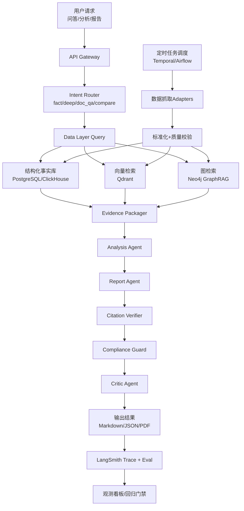

# 中国A股智能分析系统：可执行总设计文档（Single Source of Truth）

## 1. 文档定位
- 本文整合以下 4 份文档为一个可执行版本：
  - `docs/a-share-agent-system-tech-solution.md`
  - `docs/free-data-source-implementation.md`
  - `docs/prompt-engineering-spec.md`
  - `docs/prompt-test-cases-template.md`
- 目标：作为唯一主文档，指导从需求到上线的完整实现与验收。
- 文档治理约束（新增）：
  - 执行清单：`docs/implementation-checklist.md`
  - 追踪矩阵：`docs/spec-traceability-matrix.md`
  - 全局门禁：`docs/global-constraints.md`

## 2. 产品目标与边界
1. 目标
- 面向中国A股，提供“事实可追溯”的问答、分析与报告能力。
- 支持文档上传（PDF/DOC/HTML）并进入知识库与RAG。
- 支持关注股定时跟踪与自动简报。
2. 边界
- 不提供确定性买卖建议，不承诺收益。
- 输出为研究参考，必须附证据引用。

## 3. 端到端流程图（从开始到结束）

## 4. 系统架构（分层）
1. 前端层
- TypeScript + Next.js + React
- TanStack Query（服务端状态）+ Zustand（客户端状态）
2. 网关与编排层
- FastAPI + LangChain 1.x + LangGraph
- 多 Agent：Router/Data/RAG/Analysis/Report/Critic
3. 数据与记忆层
- PostgreSQL、ClickHouse、Qdrant、Neo4j、MinIO、Redis
- Long-term Memory：用户偏好、任务总结、反馈修正
4. 可观测与评测层
- LangSmith（Tracing + Eval + Regression Gate）

## 5. 免费数据源实施（不购买商业源）
1. 一级事实源（主依据）
- 巨潮、上交所、深交所（公告/披露）
2. 二级行情源（补充）
- 腾讯、网易、新浪、雪球（由 `stock-api` 适配）
3. 三级资讯源（线索）
- 东财、财联社、新浪、雪球等（由 `go-stock` 思路复用）
- 说明：`stock-api`/`go-stock` 为外部参考仓库，不作为本仓库内容；仅按需拷贝实现能力。
4. 回退策略（行情）
- 腾讯 -> 网易 -> 新浪 -> 雪球
5. 关键约束
- 不做高风险绕过抓取；线索源不可单源直接下结论

## 6. RAG 设计（可实现版）
1. 三层索引
- Fact Index（结构化）
- Doc Index（非结构化）
- Graph Index（关系）
2. 检索链路
- Query Planner -> Hybrid Retriever -> Reranker -> Evidence Packager -> Citation Verifier
3. 模式切换
- 默认 Agentic RAG
- 关系/演化问题触发 GraphRAG
4. 初始参数（MVP）
- `chunk_size=900`, `chunk_overlap=120`
- `top_k_vector=12`, `top_k_bm25=20`, `rerank_top_n=10`

## 7. Prompt 工程化（企业级）
1. 资产化
- `prompt_registry`、`prompt_release`、`prompt_eval_result`
2. 分层模板
- system/policy/task 三层
3. 运行时规范
- schema 校验变量注入、token预算、动态裁剪
4. 强制 Guardrails
- 禁止确定性投资建议
- 关键结论必须引用
- 冲突必须说明
5. 发布门禁（MVP）
- 事实正确率 >= 85%
- 引用覆盖率 >= 95%
- 幻觉率 <= 5%
- 高风险违规率 = 0

## 8. 多 Agent 运行设计
1. 主流程
- Router -> Data -> RAG -> Analysis -> Report -> Critic
2. Deep Agent 触发
- 多维对比、长时间窗回溯、并行子任务
3. 权限控制
- 按 Agent 配置工具白名单，默认最小权限

## 9. 文档处理工程
1. 输入
- PDF/DOCX/HTML
2. 流水线
- 解析 -> 表格抽取 -> 清洗 -> 分块 -> 向量化 -> 入库
3. 质量门禁
- 解析置信度不足进入复核队列
4. 版本管理
- 文档 hash、来源、版本、时间戳可追溯

## 10. 评测体系与上线门禁
1. 离线评测
- Recall@k、MRR、nDCG、事实正确率、引用覆盖率、幻觉率
2. 在线评测
- P95、成功率、成本、用户反馈
3. 回归门禁
- 未达阈值禁止发布；自动回滚到上一稳定版本
4. Prompt 测试集
- 30条模板（Golden/Boundary/RedTeam/Freshness）作为标准回归集

## 11. 数据模型（首批必须）
1. 关系库
- `instrument`、`event_fact`、`report_run`、`watchlist`
2. 对象存储
- `raw_docs/`、`parsed_docs/`、`report_exports/`
3. 向量库
- `kb_chunks`、`stock_chunks`、`report_chunks`
4. 图谱
- `Company/Event/Metric` 节点与关系

## 12. API 契约（首批）
1. Query/Report
- `POST /v1/query`
- `POST /v1/report/generate`
- `GET /v1/report/{report_id}`
2. Ingestion
- `POST /v1/ingest/market-daily`
- `POST /v1/ingest/announcements`
3. Doc Pipeline
- `POST /v1/docs/upload`
- `POST /v1/docs/{doc_id}/index`
4. Eval
- `POST /v1/evals/run`
- `GET /v1/evals/{eval_run_id}`

## 13. 实施路线图（8周）
1. 第1-2周
- 免费源接入 + 标准化 + Baseline RAG
2. 第3-4周
- LangGraph + Middleware + LangSmith tracing
3. 第5-6周
- 多 Agent 主流程 + 回归集 + Prompt 门禁
4. 第7周
- Agentic RAG 优化；GraphRAG 小范围试点
5. 第8周
- 线上灰度 + SLO监控 + 回滚演练

## 14. 工程化检查清单（上线前）
1. 平台交付
- dev/staging/prod 隔离、CI/CD、特性开关
2. 可靠性
- SLI/SLO、告警、Runbook、容灾演练
3. 数据治理
- 数据血缘、质量SLA、冲突处理策略
4. 安全合规
- 租户隔离、密钥管理、审计日志
5. FinOps
- 成本按租户/任务追踪，模型路由降本

## 15. 验收标准（DoD）
1. 数据
- 主源抓取成功率 >= 99%
- 增量入库延迟 <= 30分钟
2. 能力
- 核心场景（问答/报告/文档问答/关注股简报）全打通
3. 质量
- 事实正确率 >= 85%，引用覆盖率 >= 95%
4. 合规
- 违规投资建议命中率 100% 拦截
5. 运维
- 可观测完整，支持 trace 到 prompt/version/source

## 16. 当前版本结论
- 架构已具备“可执行可实现”条件。
- 推荐先完成单租户MVP，再扩展多租户与高级图谱推理。
- 编码前仅剩三项最终拍板：
  - MVP 股票池规模（50/300/1000）
  - 第一版报告类型（事实报告/研究报告）
  - 发布门禁阈值是否按本文默认值执行
- 实施治理规则（新增）：
  - 任何实现任务必须先登记到 `docs/implementation-checklist.md`。
  - 任何需求必须先映射到 `docs/spec-traceability-matrix.md`。
  - 任何任务完成必须满足 `docs/global-constraints.md` 硬门禁。

## 17. 核心技术实现矩阵（逐项落地）
## 17.1 状态管理（State Management）
1. 目标
- 让多步任务具备“可恢复、可追踪、可裁剪”的上下文状态。
2. 设计
- 会话短期状态：LangGraph `AgentState`（本次请求内）
- 跨会话长期状态：PostgreSQL + Memory Store（用户偏好/历史结论）
- 前端状态：TanStack Query（服务端数据）+ Zustand（界面状态）
3. 关键字段
- `intent, stock_codes, retrieval_plan, evidence_pack, risk_flags, citations, trace_id`
4. 规则
- 状态变更必须可审计；大对象只存引用ID不存全文；超预算自动裁剪。

## 17.2 LangSmith（Tracing + Eval + Gate）
1. 用途
- 全链路追踪：prompt、tool、retrieval、latency、token、cost
- 评测闭环：离线评测、在线抽样、回归门禁
2. 设计
- 每次运行写 `trace_id` 到 `report_run/agent_trace_ref`
- 发布前自动跑固定 eval suite（含 red-team）
3. 上线门禁
- 引用覆盖率、事实正确率、幻觉率、违规率均达阈值后才可发布。

## 17.3 多 Agent 协作
1. 角色拆分
- Router / Data / RAG / Analysis / Report / Critic
2. 协作方式
- LangGraph 有向图编排 + 条件分支 + 并行子任务
3. 何时并行
- 同业对比、长时间窗回溯、多个数据源交叉验证
4. 失败策略
- 节点重试 -> 分支降级 -> 兜底模板输出（带不确定性标记）

## 17.4 Long-term Memory 架构设计
1. 三层记忆
- 用户记忆：风险偏好、关注行业、展示偏好
- 任务记忆：历史结论摘要、未解决问题
- 领域记忆：高质量知识卡片（财报规则、行业口径）
2. 写入策略
- 仅写高价值信号：用户确认、人工修正、评测通过结论
3. 检索策略
- 检索时按“新鲜度 + 相关性 + 可信度”排序
4. 失效策略
- 超期记忆降权，冲突记忆标红并触发复核。

## 17.5 LangGraph 集成
1. 图结构
- `intent_router -> data_fetch -> retrieval_planner -> hybrid_retriever -> analysis -> report -> verifier -> critic -> finalize`
2. 条件分支
- 关系问题触发 `graphrag_node`
- 高风险触发 `human_review_queue`
3. 持久化执行
- 启用 checkpoint，支持中断恢复与超时继续
4. 与工具集成
- 每个节点仅允许调用本节点白名单工具。

## 17.6 Middleware 工程化（重点）
## 17.6.0 先统一术语（避免歧义）
- 你专栏中的“官方 Hook”是 LangChain Middleware 原生生命周期。
- 我文档中的 `pre_router/pre_model/...` 是平台工程层的逻辑分层。
- 两者不是冲突关系，而是“官方Hook承载平台策略”的映射关系。

## 17.6.1 官方 Hook（LangChain 原生）
1. before/after 型
- `before_agent`
- `before_model`
- `after_model`
- `after_agent`
2. wrap 型
- `wrap_model_call`
- `wrap_tool_call`
3. 执行顺序规则
- `before_*`：顺序执行（A->B->C）
- `wrap_*`：洋葱嵌套（A包B包C）
- `after_*`：逆序执行（C->B->A）

## 17.6.2 平台 Hook 分层（工程映射）
1. `pre_router_hook`
- 承载在 `before_agent`：鉴权、限流、租户校验、意图先验
2. `pre_model_hook`
- 承载在 `before_model`：Prompt拼装、schema校验、token预算、上下文裁剪
3. `post_model_hook`
- 承载在 `after_model`：结构化校验、风险词检测、引用占位检查
4. `pre_tool_hook`
- 承载在 `wrap_tool_call` 前半段：工具权限、参数校验、超时重试策略注入
5. `post_tool_hook`
- 承载在 `wrap_tool_call` 后半段：结果规范化、异常分级、可靠性打分
6. `pre_response_hook`
- 承载在 `after_agent` 前半段：合规模板注入、免责声明、最终引用核验
7. `post_response_hook`
- 承载在 `after_agent` 后半段：审计落盘、指标埋点、trace 关联

## 17.6.3 内置 Middleware 选型（建议默认栈）
1. 安全
- `PIIMiddleware`
- `HumanInTheLoopMiddleware`（高风险工具强制审批）
2. 可靠性
- `ModelCallLimitMiddleware`
- `ToolCallLimitMiddleware`
- `ToolRetryMiddleware`
- `ModelFallbackMiddleware`
3. 性能
- `SummarizationMiddleware`
- `ContextEditingMiddleware`
4. 能力增强
- `TodoListMiddleware`
- `LLMToolSelectorMiddleware`

## 17.6.4 生产配置要点（来自专栏实践）
1. Human-in-the-loop 必须配 Checkpointer
- 无 checkpoint 无法中断恢复
2. 环境分层
- dev/staging/prod 使用不同 middleware stack
3. Feature Flags
- 按租户/用户灰度开启中间件能力
4. 性能约束
- 避免在 hook 内做阻塞 I/O；对额外 LLM 调用设置预算
5. 可观测性
- 每个 hook 记录耗时、错误码、影响的 token/cost

## 17.6.5 测试策略（中间件专属）
1. 单测
- 测每个 hook 输入输出与副作用
2. 集成测试
- 测多 middleware 组合顺序与冲突
3. 回归测试
- 测新增中间件对质量、延迟、成本影响
4. 红队测试
- prompt injection、越权工具调用、合规绕过

## 17.6.6 Hook 分层（简表）
1. `pre_router_hook`
- 用途：请求合法性校验、租户鉴权、限流、意图先验标签
2. `pre_model_hook`
- 用途：Prompt 拼装、变量 schema 校验、token 预算、上下文裁剪
3. `post_model_hook`
- 用途：结构化输出校验、术语标准化、风险词检测、引用占位检查
4. `pre_tool_hook`
- 用途：工具权限校验、参数校验、超时/重试配置、幂等键注入
5. `post_tool_hook`
- 用途：结果规范化、异常分级、来源可靠性打分、缓存写入
6. `pre_response_hook`
- 用途：合规文案注入、免责声明、最终引用校验
7. `post_response_hook`
- 用途：审计落盘、埋点、LangSmith trace 关联

## 17.6.7 关键设计原则
- Hook 可组合：全局Hook + 场景Hook + 租户Hook
- 失败可控：任一关键Hook失败时阻断输出或降级
- 可观测：每个Hook输出耗时与错误码
- 可回放：同输入可重放验证

## 17.6.8 与你专栏的对应关系
- 对应文档：`docs/LangChain笔记/第八篇 Middleware 工程化.md`
- 本总文档已纳入：
  - 官方 6 Hook
  - 执行顺序与洋葱模型
  - 内置中间件默认栈
  - 生产配置与测试策略

## 17.7 Deep Agents
1. 触发条件
- 用户请求复杂度高（多目标、多约束、长时间窗）
2. 运行模式
- Planner 先拆任务，再由多个 Sub-Agent 并行执行
3. 约束
- 限制最大子任务数、总token、总时长
4. 输出
- 聚合结果必须带子任务证据链与冲突说明。

## 17.8 文档处理工程
1. 输入支持
- PDF/DOCX/HTML（后续可扩展图片OCR）
2. 流水线
- 解析 -> 结构化抽取（标题/段落/表格）-> 去噪 -> 分块 -> 向量化
3. 难点策略
- 表格优先保真；OCR置信度低则进入复核队列
4. 版本治理
- 文档哈希、来源、时间戳、版本号全记录。

## 17.9 RAG 集成：GraphRAG + AgenticRAG + 测评
1. AgenticRAG（默认）
- 先规划检索步骤，再多轮补证，最后合成答案
2. GraphRAG（条件触发）
- 关系/演化问题走图检索与子图推理
3. 混合检索
- BM25 + Vector + Metadata Filter + Reranker
4. 评测维度
- 检索：Recall@k/MRR/nDCG
- 生成：事实正确率/引用覆盖率/幻觉率
- 业务：时效性/冲突解释质量/可执行性
5. 发布门禁
- 关键指标不达标禁止上线。

## 17.10 LangChain 1.0（必须使用点）
1. `create_agent`
- 统一 agent 创建方式，减少自定义拼接错误
2. Middleware
- 使用官方 middleware 机制承载 pre/post 逻辑
3. Structured Output
- 统一输出 schema，保证下游可解析
4. Tool Strategy
- 工具选择与调用策略显式化，支持审计与回放
5. 与 LangGraph 协同
- LangChain 负责“节点内能力”，LangGraph 负责“节点间编排”。

## 17.11 14阶段专栏技术映射（并入核心技术实现矩阵）
> 说明：此映射用于把“专栏14阶段”与系统实施一一对应。当前先给可执行版阶段框架，待你提供14篇文章标题后可精确替换为“文章名 -> 工程任务”映射。

### 阶段1：问题定义与边界约束
- 目标：明确用户、场景、能力边界、合规边界
- 对应技术：产品规则引擎、风险策略、免责声明模板

### 阶段2：数据源分层与可信度体系
- 目标：定义一级事实源/二级行情源/三级线索源
- 对应技术：source adapter、reliability score、冲突检测

### 阶段3：数据标准化与治理
- 目标：统一字段口径、代码规范、时间标准
- 对应技术：canonical schema、metadata、lineage

### 阶段4：文档处理工程
- 目标：PDF/DOC/HTML 解析、表格抽取、版本管理
- 对应技术：doc pipeline、OCR、质量门禁

### 阶段5：RAG Baseline
- 目标：先打通可用检索问答闭环
- 对应技术：vector index、citation verifier、拒答策略

### 阶段6：Hybrid RAG
- 目标：提升召回质量与稳健性
- 对应技术：BM25 + Vector + Reranker + Metadata Filter

### 阶段7：GraphRAG
- 目标：支撑关系推理与全局主题演化分析
- 对应技术：Neo4j、实体关系抽取、子图检索

### 阶段8：Agentic RAG
- 目标：复杂问题拆解、多轮补证、冲突处理
- 对应技术：planner、multi-step retrieval、evidence pack

### 阶段9：LangChain 1.0 工程化
- 目标：统一 agent 开发范式
- 对应技术：create_agent、structured output、tool strategy

### 阶段10：LangGraph 状态编排
- 目标：实现可恢复、可追踪、可分支流程
- 对应技术：StateGraph、checkpoint、HITL

### 阶段11：多 Agent 协作与 Deep Agents
- 目标：复杂任务并行化与职责隔离
- 对应技术：Router/Data/RAG/Analysis/Report/Critic、sub-agents

### 阶段12：Prompt 工程化
- 目标：prompt 资产化、版本化、门禁化
- 对应技术：prompt registry、hook中间件、red-team测试

### 阶段13：LangSmith 评测与上线门禁
- 目标：追踪、评测、回归、防回退事故
- 对应技术：trace、dataset、experiment、release gate

### 阶段14：生产化运维与治理
- 目标：SLO、成本、审计、CI/CD、容灾
- 对应技术：监控告警、回滚、FinOps、ADR制度

## 17.12 14阶段统一交付物（每阶段都要产出）
1. 设计产物
- 阶段目标、输入输出、关键决策（ADR）
2. 工程产物
- 代码/配置/评测数据/回归报告
3. 质量产物
- 指标结果、失败案例、回滚条件
4. 运营产物
- 监控面板、告警规则、值班手册

## 17.13 需你补充以完成“精准映射”的信息
1. 你的14篇文章标题清单（按顺序）
2. 每篇文章希望关联的“实现优先级”（P0/P1/P2）
3. 是否有不纳入首版MVP的阶段

## 18. 实施治理与防遗漏机制（新增）
1. 单一执行真相源
- 所有执行状态以 `docs/implementation-checklist.md` 为准。

2. 需求追踪闭环
- 所有需求点必须在 `docs/spec-traceability-matrix.md` 有映射后方可执行。

3. 强门禁机制
- 门禁阈值与完成规则统一由 `docs/global-constraints.md` 约束。
- 未满足硬门禁时禁止标记任务为完成。

4. 记录要求
- 每个任务完成记录至少包含：`Task ID`、`Spec Ref`、执行命令、关键输出、日期。

## 19. Multi-Provider LLM Gateway (Production Hardening)
1. Objective
- External real LLM inference must be used in Agent final synthesis stage.
- Support multi-provider/model failover to avoid single-key or single-vendor outage.

2. Implementation Constraints
- Config-driven providers list (`backend/config/llm_providers*.json`).
- Provider fields: `name`, `api_style`, `api_base`, `model`, `api_key/api_key_env`, timeout, retry, sampling params.
- Native Anthropic Messages mode must include `anthropic-version` request header.

3. Failover Policy
- Try providers in configured order.
- On timeout/network/HTTP/parse error, switch to next provider.
- If all providers fail, fallback to local synthesis path (service degradation, not outage).

4. Runtime Hooks
- Emit tracing events: `llm_provider_success`, `llm_provider_error`, `external_model_failed`.
- Attach risk flag when external model path fails.

5. Security
- API keys must be stored in local-only config or env vars.
- Local key files must be gitignored (`backend/config/*.local.json`).

6. Current Delivered Artifact (2026-02-14)
- New module: `backend/app/llm/gateway.py`
- Workflow integration with fallback: `backend/app/agents/workflow.py`
- Service injection: `backend/app/service.py`
- Startup env wiring: `start-backend.bat`
