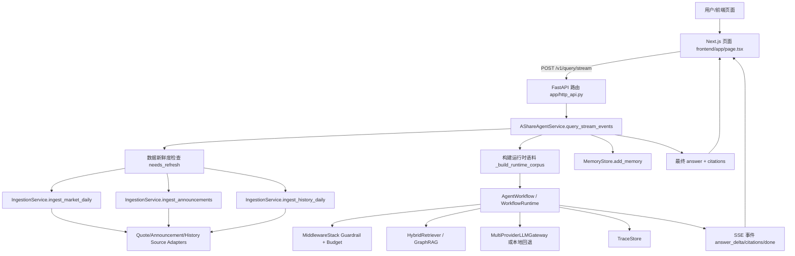
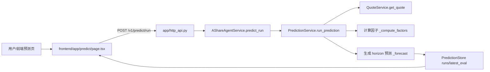

# 06 新同学全景理解与数据流图

本文从“第一次接触项目”的视角，结合 Java 后端工程师熟悉的分层模式，快速理解 `StockPilotX`。

## 1. 先看什么（30 分钟上手路径）
1. 看入口：`backend/app/http_api.py`、`backend/app/service.py`。
2. 看主链路：`/v1/query` 和 `/v1/query/stream` 对应的调用流。
3. 看数据来源：`backend/app/data/sources.py`、`backend/app/data/ingestion.py`。
4. 看前端如何调用：`frontend/app/page.tsx`（SSE 流式问答）、`frontend/app/predict/page.tsx`（预测任务）。
5. 看持久化：`backend/app/web/store.py`、`backend/app/memory/store.py`、`backend/app/prompt/registry.py`。

## 2. 项目结构速览（按职责）
```text
StockPilotX/
├─ backend/
│  ├─ main.py                      # 本地演示入口
│  ├─ app/http_api.py              # FastAPI 路由层（Controller）
│  ├─ app/service.py               # 统一应用服务门面（ApplicationService/Facade）
│  ├─ app/agents/                  # Agent 工作流与运行时（direct/langgraph）
│  ├─ app/data/                    # 数据摄取、调度、外部数据源适配
│  ├─ app/rag/                     # 检索与 GraphRAG
│  ├─ app/predict/                 # 因子与预测域服务
│  ├─ app/web/                     # Web 业务域（鉴权、关注列表、报表、运维）
│  ├─ app/middleware/              # Guardrail/Budget 中间件
│  ├─ app/llm/                     # 多模型网关与回退
│  ├─ app/observability/           # trace 事件
│  ├─ app/memory/                  # 长期记忆（SQLite）
│  └─ app/prompt/                  # Prompt 版本与评测记录（SQLite）
├─ frontend/app/                   # Next.js 页面与 API 调用
├─ docs/                           # 架构、规范与操作文档
└─ tests/                          # 测试目录
```

## 3. Java 后端分层类比
- `http_api.py` -> Spring MVC `Controller`
- `service.py:AShareAgentService` -> `ApplicationService` + `Facade`
- `models.py` -> DTO + 参数校验（类似 `jakarta validation`）
- `agents/workflow.py` -> 业务编排器（可类比 Pipeline/State Machine）
- `middleware/hooks.py` -> Filter/Interceptor + AOP Around Advice
- `data/sources.py` -> 外部数据源 Adapter（第三方 API 适配层）
- `data/ingestion.py` -> 数据同步 Service/Job Service
- `data/scheduler.py` -> 轻量 JobScheduler（带重试/熔断/暂停）
- `web/service.py` + `web/store.py` -> 业务域 Service + Repository(SQLite)
- `memory/store.py`、`prompt/registry.py` -> 领域侧持久化组件

## 4. 核心数据流图（问答主链路）


## 5. 核心数据流图（预测链路）


## 6. 模块解释（第一次接触要点）
- `backend/app/service.py`
  这是系统总装配点，初始化并持有 workflow、ingestion、prediction、web、memory、prompt、scheduler。
- `backend/app/http_api.py`
  纯路由层，方法基本只做参数透传和异常转译，复杂逻辑都在 `AShareAgentService`。
- `backend/app/agents/*`
  Agent 执行引擎。支持 `direct` 和 `langgraph` 两套 runtime，入口统一是 `workflow_runtime.run/run_stream`。
- `backend/app/middleware/hooks.py`
  典型洋葱模型：前置改写 prompt、包裹模型调用计数、后置补安全声明。
- `backend/app/data/*`
  `sources.py` 对接外部行情/公告/历史数据，`ingestion.py` 做标准化落库（MVP 为内存容器），`scheduler.py` 做任务调度与熔断。
- `backend/app/web/*`
  Web 功能域（auth/watchlist/report/docs/ops/stock-universe），底层是 `web.db` SQLite。
- `backend/app/predict/service.py`
  因子与预测域服务，当前是可回归验证的规则基实现，输出 5d/20d 预测与风险分层。
- `backend/app/llm/gateway.py`
  统一外部 LLM 网关，支持多 provider 顺序回退与流式输出；失败可降级本地生成。

## 7. 关键运行时状态与数据存储
- 内存态（进程内）：
  `IngestionStore`、`PredictionStore`、`TraceStore._events`、`AShareAgentService._reports`。
- SQLite：
  `memory.db`（长期记忆）、`prompt.db`（Prompt/评测/发布）、`web.db`（用户、关注列表、报告索引、告警、股票库）。

## 8. 给 Java 同学的阅读建议
1. 先把 `AShareAgentService` 当作“单体门面层”，沿方法名跳转到子域服务。
2. 再把 `AgentState` 当作“请求级上下文对象”，看它在 workflow 各阶段如何被填充。
3. 最后看中间件和网关：这两处决定了线上行为（风控、预算、模型回退）。
