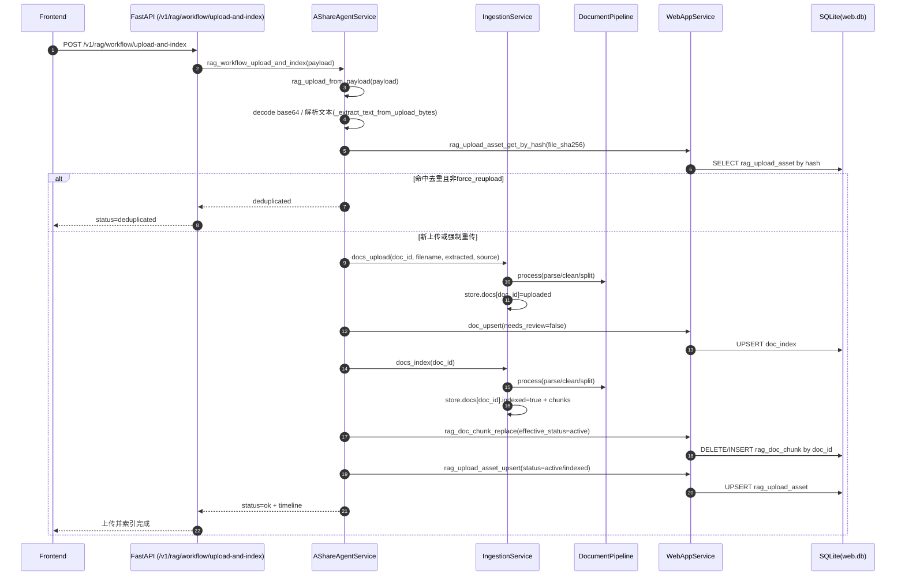
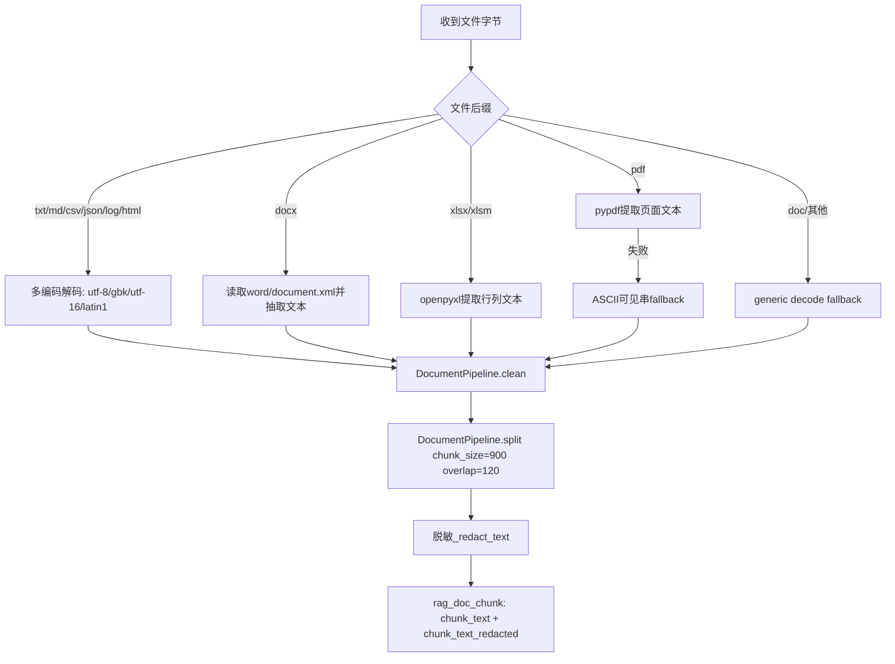
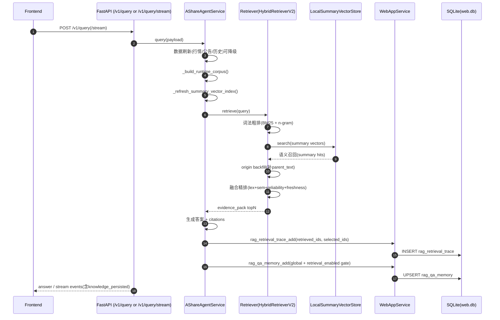
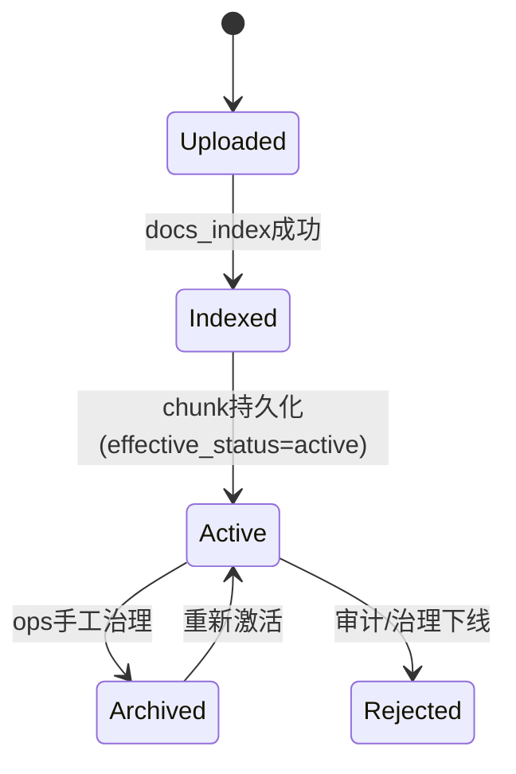

# StockPilotX RAG 时序图版说明（接口调用 + 入库顺序）

## 1. 文档目的
- 给研发/产品/运维一个“看图即懂”的版本。
- 重点回答三件事：
  - 附件上传后如何清洗并入库。
  - 查询时粗排/精排如何串起来。
  - 每一步落哪些表、依赖哪些状态字段。

## 2. 上传与索引时序（Upload -> Parse -> Index -> Active）

## 3. 文档清洗细节（按类型）

说明：
- `.doc` 当前没有专用解析器，走通用解码降级路径。
- `pdf` 有 `pypdf` 则用结构化提取；无依赖/失败时最少保留可检索 ASCII 文本。

## 4. 查询链路时序（Retrieval + Rerank + Memory Writeback）

## 5. 粗排与精排公式（实现口径）

## 5.1 粗排（词法）
- 组件：`HybridRetriever`
- 候选：
  - BM25 topK
  - n-gram 相似度 topK
- 粗排分：
  - `score = 0.55*bm25 + 0.35*vector_ngram + 0.10*reliability`

## 5.2 精排（融合）
- 组件：`HybridRetrieverV2`
- 融合特征：
  - `lex_rank_score`
  - `sem_rank_score`
  - `freshness_score`
  - `reliability_score`
- 精排分：
  - `final = 0.45*lex + 0.35*sem + 0.10*reliability + 0.10*freshness`

## 5.3 summary-first + origin-backfill
- 先用摘要做语义召回，降低噪声。
- 再补原文（`origin_backfill=true`）保证可读证据完整。
- 回填分数轻微折扣（`*0.92`）避免原文挤占摘要排序。

## 6. 关键表写入顺序（Checklist）
1. `doc_index`：上传/索引后的文档元信息（当前 `needs_review=false`）。
2. `rag_doc_chunk`：可检索文档分块（当前默认 `effective_status=active`）。
3. `rag_upload_asset`：上传资产与去重信息（hash、tags、parse_note、status）。
4. `rag_retrieval_trace`：每次查询的召回/入选轨迹与时延。
5. `rag_qa_memory`：答案沉淀（raw + redacted + summary + 质量门禁）。
6. `rag_ops_meta`：如 `last_reindex_at` 运维元数据。

## 7. 状态机（业务视角）

备注：
- 当前产品策略是“上传即生效”，即 `Indexed` 后直接进入 `Active`。
- 仍保留运维治理能力（按 chunk/doc 调整状态）。

## 8. 代码入口速查
- 上传解析链路：`backend/app/service.py`
  - `rag_upload_from_payload`
  - `_extract_text_from_upload_bytes`
  - `_persist_doc_chunks_to_rag`
- 文档清洗：`backend/app/docs/pipeline.py`
- 查询检索：`backend/app/service.py`
  - `_build_runtime_corpus`
  - `_build_runtime_retriever`
  - `_semantic_summary_origin_hits`
- 粗排：`backend/app/rag/retriever.py`
- 精排：`backend/app/rag/hybrid_retriever_v2.py`
- 向量索引：`backend/app/rag/vector_store.py`
- 持久层：`backend/app/web/store.py`、`backend/app/web/service.py`

